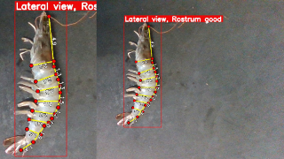
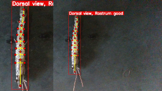
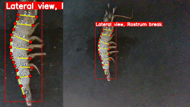
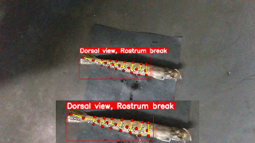

<h1 align="left">ImaShrimp: Automatic White Shrimp  (Penaeus vannamei) Biometrical Analysis from Laboratory Images Using Computer Vision and Deep Learning </h1> 

<p align="center">
  <a href="#Dataset">Dataset</a> |
  <a href="#Results">Results</a> |
  <a href="#Usage">Usage</a> |
  <a href="#Acknowledge">Acknowledge</a>
</p>

<p align="center">
<a href=""></a> <a href=""></a>
</p>
<p align="center">
<a href=""></a>    <a href=""></a>
</p>

This branch contains the **public access** of <a href="https://www.overleaf.com/read/nsrxnkxdzbqf#6a5fbf">ImaShrimp: Automatic White Shrimp (Penaeus vannamei) Biometrical Analysis from Laboratory Images Using Computer Vision and Deep Learning</a>. It obtains **0.8 mm Mean Average Error (MAE)** when comparing ground truth and predicted measurements on a test set of the dataset.

## Dataset
The dataset contains 12367 annotated images with 23 key points each. Additionally, information about the animal's point of view (Lateral or Dorsal) and the integrity of its rostrum (Good or Broken) is available. The dataset is organized as follows:

```plaintext
📦 ImaShrimp_dataset/
├── 📁 classification/                  
│   ├── 📁 point_of_view/              
│   └── 📁 rostrum integrity/          
│
└── 📁 pose_estimation/
    ├── 📁 23KP_lateral/
    ├── 📁 23KP_dorsal/     
    ├── 📁 22KP_lateral/        
    └── 📁 22KP_dorsal/  
```
The link to the dataset is not currently available.
## Results
All the results presented below were obtained using the code in this repository and the test set of the <a href="#ImaShrimp Dataset">ImaShrimp Dataset</a> (1236 images). 
The results are divided into three main sections: **(1) Classification**, **(2) Pose Estimation** and **(3) Size Regression**.
### (1) Classification
#### Point of View Discriminator

| Classifier          | Error (%) | Correct   | Incorrect |
| ------------------- |-----------|-----------|-----------|
| Human               | 0.97      | 1224      | 12        |
| AI                  | 0.00      | 1236      | 0         |
| **Human-AI (Ours)** | **0.00** ​📌 | **1236**  | **0**   |

#### Rostrum Integrity Discriminator

| Classifier          | Error (%) | Correct  | Incorrect |
| ------------------- |-----------| -------- | --------- |
| Human               | 12.46     | 1082     | 154       |
| AI                  | 13.35     | 1071     | 165       |
| **Human-AI (Ours)** | **3.64** ​📌 | **1191** | **45**    |

### (2) Pose Estimation
#### Performance of the pose estimation modules on the test dataset

| Model        | Nº images | mAP 50:95 (%) | PCK_10px (%) |
|--------------|-----------|---------------|--------------|
| Dorsal-22    | 49        | 89.85         | 88.22        |
| Lateral-22   | 104       | 97.62         | 86.71        |
| Dorsal-23    | 336       | 89.11         | 85.17        |
| Lateral-23   | 747       | 95.92         | 83.73        |
| **General**  | **1236**  | **93.12** ​📌    | **85.96**    |


#### Comparative error analysis of real and predicted key points in pixels

| Point_of_view | EPE (px)       | RMSE (px) | MAPE (%) |
|---------------|----------------| --------- | -------- |
| Lateral   | **6.53 ± 11.96** | 9.64  | 0.57 |
| Dorsal    | **6.15 ± 7.00**    | 6.59  | 0.53 |
### (3) Size Regression
#### Conversion using regression
| Variable    | MAE (cm)          | RMSE (cm) | MAPE (%) |
|-------------|-------------------| --------- | -------- |
| Lengths     | 0.09 ± 0.14       | 0.14      | 5.37     |
| Heights     | 0.07 ± 0.10       | 0.10      | 3.54     |
| Widths      | 0.06 ± 0.08       | 0.08      | 5.63     |
| **General** | ✅​ **0.08 ± 0.10** | **0.10**  | **4.56** |


## Usage
We use PyTorch 2.7.1+cu118, [imashrimp_mmcv](https://github.com/AbiamRemacheGonzalez/imashrimp_mmcv) and [imashrimp_VitPose](https://github.com/AbiamRemacheGonzalez/imashrimp_ViTPose) for the experiments.
```bash
git clone https://github.com/AbiamRemacheGonzalez/ImaShrimp                 # Not this public repository.
cd 1_pose_estimation
git clone https://github.com/AbiamRemacheGonzalez/imashrimp_mmcv
git clone https://github.com/AbiamRemacheGonzalez/imashrimp_ViTPose
cd ..
pip install -r requirements.txt
```
We must necessarily add in the [CompleteSystemConfig.py](https://github.com/AbiamRemacheGonzalez/imashrimp_ViTPose/blob/main/configs/animal/2d_kpt_sview_rgb_img/topdown_heatmap/camaron/CompleteSystemConfig.py) file:
- Dataset path
- Pre-trained models to "Point of View" and "Rostrum Integrity" classifiers
- Result directory path
> **Note:** These fields are mandatory for the correct functioning of the system

After that we can run the manager script [manager.py](manager.py) file:

## Acknowledge
We acknowledge the excellent implementation from [mmcv](https://github.com/AbiamRemacheGonzalez/imashrimp_mmcv) and [VitPose](https://github.com/AbiamRemacheGonzalez/imashrimp_ViTPose).


## Citing ImaShrimp
For ImaShrimp 🦐, please cite the following paper:

```
@misc{Abiam2025,
  author    = {Abiam Remache González},
  title     = {IMASHRIMP: Automatic White Shrimp (Penaeus vannamei) Biometrical Analysis from 
               Laboratory Images Using Computer Vision and Deep Learning},
  note      = {Manuscrito no publicado},
  year      = {2025},
  howpublished = {Disponible en Overleaf: \url{https://www.overleaf.com/read/nsrxnkxdzbqf#6a5fbf}},
}
```

## Accessing to ImaShrimp
For accessing to the latest version of ImaShrimp, please contact using this email <a href="mailto:abiam.remache101@alu.ulpgc.es">Abiam Remache González</a>.